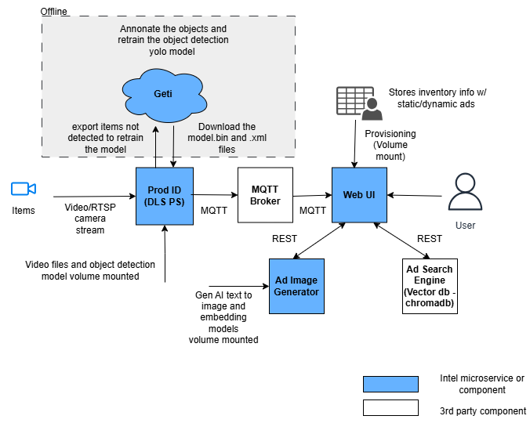

# Digital Signage: Context-Aware, Cross-Selling Approach

## Overview

The Context-Aware, Cross-Selling Approach is an end-to-end, containerized solution for intelligent digital signage. It leverages AI-based product identification, real-time video analytics, and generative AI to display contextually relevant advertisements in retail or similar environments. The system is modular, scalable, and designed for edge deployment.

**Key Features:**
- Real-time product detection and classification from video streams
- Dynamic advertisement generation using generative AI
- Web-based UI for monitoring and control
- Modular microservices architecture (PID, AIG, ASe, Web UI)
- Support for RTSP cameras and custom models (including Intel® Geti™ exports)

## Minimum System Requirements

- **CPU:** Intel(R) Core(TM) Ultra (Series 2) processor or above having at least 16 cores
- **RAM:** 16 GB minimum (32 GB recommended)
- **Disk:** 500 GB free space
- **GPU:** Intel® iGPU
- **OS:** Ubuntu 24.04 LTS (Linux x86_64)
- **Docker:** Docker Engine 24.x+, Docker Compose v2
- **Network:** Access to internet for model downloads and container pulls

## Architecture

The solution is composed of the following main components:

1. **Product Identification (PID):**
   - Detects and classifies products in video streams using DL Streamer Pipeline Server and YOLO models.
   - Publishes detection results via MQTT.
2. **Advertise Image Generator (AIG):**
   - Generates custom advertisements using generative AI (Stable Diffusion XL Turbo, MiniLM, etc.).
   - Supports logo, slogan, and price overlays.
3. **Advertise Searcher (ASe):**
   - Retrieves and ranks relevant ads based on detected products and context.
   - Uses ChromaDB for vector search.
4. **Web UI:**
   - Provides a browser-based interface for video, ad display, and system monitoring.
   - Integrates with AIG and PID for real-time updates.

**Supporting Services:**
- **MediaMTX:** RTSP/WebRTC streaming relay
- **Mosquitto:** MQTT broker for inter-service communication
- **ChromaDB:** Vector database for ad search
- **COTURN:** TURN server for WebRTC

**High-Level Architecture:**




## Repository Structure

```
digital-signage/
├── aig/         # Advertise Image Generator (AIG) microservice
├── pid/         # Product Identification (PID) microservice
├── web-ui/      # Web-based user interface
├── diagrams/    # Architecture diagrams
├── docker-compose.yml
├── Makefile
├── .env         # Main environment configuration
└── ...
```

## Quick Start

### Clone Source Code

```bash
git clone https://github.com/intel-sandbox/CACS_SignageApproach.git digital-signage
cd digital-signage
```

### Build & Prepare Models

> **NOTE:** Run all commands as a regular (non-root) user, without using `sudo`.

#### 1. Download YOLO11s Model (for PID)

> Please review the [YOLO11s license](https://github.com/ultralytics/ultralytics/blob/main/LICENSE).

```bash
cd pid && \
wget https://raw.githubusercontent.com/intel-retail/automated-self-checkout/v3.6.3/download_models/downloadAndQuantizeModel.sh && \
sed -i 's|MODELS_PATH="${MODELS_DIR:-/workspace/models}"|MODELS_PATH="${MODELS_DIR:-$PWD/models}"|g' downloadAndQuantizeModel.sh && \
sed -i 's/MODEL_NAME="yolo11n"/MODEL_NAME="yolo11s"/g' downloadAndQuantizeModel.sh && \
rm -rf .modelenv && \
python3 -m venv .modelenv && \
source .modelenv/bin/activate && \
pip3 install -r model_download_requirements.txt && \
rm -rf models && \
chmod +x downloadAndQuantizeModel.sh && \
./downloadAndQuantizeModel.sh && \
rm ./downloadAndQuantizeModel.sh && \
deactivate && \
cd ..
```
The quantized model will be saved to `./pid/models/object_detection/yolo11s`.

#### 2. Download SDXL-Turbo and MiniLM Models (for AIG)

> Please review the [SDXL-Turbo license](https://huggingface.co/stabilityai/sdxl-turbo/blob/main/LICENSE.md).

```bash
cd aig && \
rm -rf .modelenv && \
python3 -m venv .modelenv && \
source ./.modelenv/bin/activate && \
pip3 install -r export-requirements.txt && \
export HF_HUB_ENABLE_HF_TRANSFER=1 && \
optimum-cli export openvino --model stabilityai/sdxl-turbo --task stable-diffusion-xl --weight-format int8 ./models/sdxl_turbo_ov/int8 && \
huggingface-cli download sentence-transformers/all-MiniLM-L12-v2 --local-dir ./models/all-MiniLM-L12-v2 && \
deactivate && \
cd ../
```
Models will be downloaded to `./aig/models/`.

### Build Docker Images

```bash
make build
```

### Configuration

1. Edit the `.env` file and configure the following variables (refer to the comments in the file for additional guidance):

   - `HOST_IP`: Specify the host system IP address.
   - `MTX_WEBRTCICESERVERS2_0_USERNAME`: Set a username with a minimum of 5 alphabetic characters.
   - `MTX_WEBRTCICESERVERS2_0_PASSWORD`: Set a password with at least 8 alphanumeric characters, including at least one digit.
   - *(Optional)* Configure `RTSP_CAMERA_IP`, `AIG_*`, and `ASE_*` variables for advanced settings as needed.

2. *(Optional)* To enable pre-defined advertisements, update the [web-ui/ProductAssociations.csv](web-ui/ProductAssociations.csv) file and the [web-ui/pre-defined-ads/](web-ui/pre-defined-ads/) directory accordingly. The CSV file should reference image filenames located in the `pre-defined-ads` directory. Please note that only JPEG/JPG image formats are supported.


### Deploy the Application

```bash
make up
```

This will validate your environment, check models, and start all containers.

### Access the Web Interface

Open Google Chrome and navigate to:

```
http://<HOST_IP>:5000
```

You should see the live video stream and dynamic advertisements.

### Verify & Monitor

Check container status:

```bash
docker ps
```

If any container is restarting, check logs:

```bash
docker logs -f <container_name>
```

### Undeploy

To stop and remove all containers and volumes:

```bash
make down
```

---

## Changing Inferencing Device (CPU/GPU/NPU)

By default, the PID component performs inference on the `CPU`, while the AIG component uses the `GPU`. You can customize the target device for AI inferencing in both components as follows:

### PID (Product Identification)

- **Configuration:** Update the `device` parameter within `pid/config.json`.
- **Example:**

   ```json
   "parameters": {
      "detection-properties": {
         "model": "<model_path>",
         "device": "CPU"
      }
   }
   ```

- **Available options:** `CPU`, `GPU`, or `NPU`

### AIG (Advertise Image Generator)

- **Configuration:** Set the `AIG_MODEL_DEVICE` variable in the `.env` file.
- **Example:**
   ```env
   AIG_MODEL_DEVICE=GPU
   ```
- **Available options:** `CPU` or `GPU`

After updating the device configuration, redeploy the application to apply changes:
```bash
make down
make up
```


## REST API Documentation

### AIG (Advertise Image Generator) REST API

The AIG service exposes REST endpoints for generating and managing advertisements.

**Base URL:** `http://<HOST_IP>:<AIG_PORT>` (By default, `AIG_PORT` value is set to 5003 in `.env` file)

#### Key Endpoints

- `POST /aig/minf/`
   - **Description:** Generate an advertisement image from input text and parameters (logo, slogan, price, etc.).
   - **Request Body (JSON):**
      ```json
      {
         "prompt": "string",         // Description for image generation
         "logo_path": "string",     // (optional) Path to logo file
         "slogan": "string",        // (optional) Slogan text
         "price": "string"          // (optional) Price text
      }
      ```
   - **Response:** Image (binary or base64-encoded)

- `POST /ase/predef/`
   - **Description:** Store a predefined advertisement in the database.
   - **Request Body:** Ad metadata and image

- `POST /ase/predef/query/ad`
   - **Description:** Query for relevant ads based on product/context.
   - **Request Body:** Query parameters
   - **Response:** List of matching ads

---

### PID (Product Identification) REST API

The PID service (DL Streamer Pipeline Server) exposes REST endpoints for pipeline management and status.

**Base URL:** `http://<PID_HOST>:8080`

For REST API docs, refer [link](https://docs.openedgeplatform.intel.com/2025.2/edge-ai-libraries/dlstreamer-pipeline-server/api-reference.html)

## Advanced: RTSP Camera Configuration

1. **Obtain RTSP URI** from your camera software (test with VLC if needed).
2. Edit `pid/config.json` and update the `pipeline` string:

   ```json
   "pipeline": "rtspsrc location=\"rtsp://<USERNAME>:<PASSWORD>@<RTSP_CAMERA_IP>:<PORT>/<FEED>\" latency=100 name=source ! rtph264depay ! avdec_h264 ! videoconvert ! videoscale ! video/x-raw,format=BGR,width=1280,height=720 ! gvadetect name=detection ! queue ! gvawatermark ! gvafpscounter ! appsink name=destination"
   ```
3. Set `RTSP_CAMERA_IP` in `.env`.
4. Redeploy with `make down && make up`.

For more on RTSP, see [RTSP protocol](https://en.wikipedia.org/wiki/Real_Time_Streaming_Protocol) and [DL Streamer Pipeline Server RTSP guide](https://docs.openedgeplatform.intel.com/2025.2/edge-ai-libraries/dlstreamer-pipeline-server/advanced-guide/detailed_usage/camera/rtsp.html#rtsp-cameras).

## Advanced: Using Intel® Geti™ Exported YOLO Model

> **Prerequisites:**
> 1. Refer to the [official Geti documentation for offline installation instructions](https://docs.geti.intel.com/docs/user-guide/getting-started/installation/using-geti-installer). As DL Streamer Pipeline Server is using 2.7.1 geti sdk version, install the latest geti version or version above 2.6 as per [compatibility](https://docs.geti.intel.com/docs/user-guide/geti-fundamentals/deployments/?_highlight=compatible#compatibility)
> 2. See the [Geti Tutorials](https://docs.geti.intel.com/docs/user-guide/getting-started/use-geti/tutorials) for step-by-step guides on creating projects, labeling data, training models, and exporting results.
> 3. Review the [Supported Models in Geti](https://docs.geti.intel.com/docs/user-guide/getting-started/use-geti/supported-models) to ensure your project uses a YOLO or other object detection architecture for export to OpenVINO™ IR format.
> 4. Follow the [Model Download Instructions](https://docs.geti.intel.com/docs/user-guide/geti-fundamentals/deployments/#lets-download-the-model) to export your trained model as OpenVINO™ IR files (`.xml`/`.bin`). This process includes selecting the correct export format and downloading the files for deployment.


1. **Export** your YOLO model from Intel® Geti™ as OpenVINO™ IR (`.xml`/`.bin`).
2. Place files in `./pid/models/yolo11_geti_ir/`.
3. Edit the `pid/config.json` file and update the `model` parameter to point to your exported model file:

   ```json
   "parameters": {
      "detection-properties": {
         "model": "/home/pipeline-server/yolo11_geti_ir/<YOUR_MODEL_NAME>.xml",
         "device": "CPU"
      }
   }
   ```
   Replace `<YOUR_MODEL_NAME>` with the actual filename (without extension) of your exported YOLO model.

4. Redeploy the application to apply changes:

   ```bash
   make down
   make up
   ```
5. Check logs for model loading success:

   ```bash
   docker logs -f <pid_container_name>
   ```

---

## License

This project is licensed under the Apache 2.0 License. See [LICENSE](LICENSE) for details.

