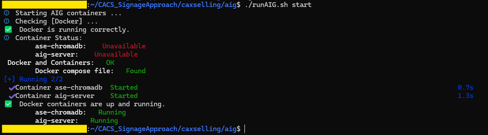
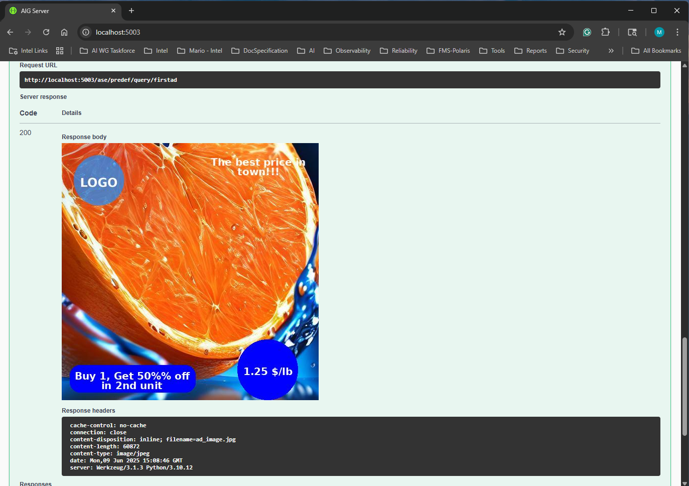

# Advertise Searcher (ASE)

| [Project Readme.md](../../README.md) | [CAXSelling Readme.md](../README.md) |

It describes functionalities and package organization for the Advertise Searcher (ASE). It aims to look for the most similar pre-registered ads, contrasting the descriptive text in the query and the stored ad description. It is a complementary feature for the image generation. On the one hand, the AIG generates a new image dynamically based on a user description. On the other hand, the ASe looks for the most similar pre-defined ads based on the user description. Both approaches will return the image plus the requested add-ons (for example, logo, slogan, etc).It is helpful when the customer wishes to combine dynamic image generation based on item detection and the most relevant corporate/institutional ads in the series of ads to project in the digital signage in the customer's walking line.

This functionality has been merged into the Advertise Image Generator (AIG) server because of the shared libraries and services, extending the original behavior.

Content:

- [Conceptual Approach and Container Initialization](#conceptual-approach-and-container-initialization)
  - [Configuration](#configuration)
- [Intel Hardware Drivers](#intel-hardware-drivers)
- [Management Scripts](#management-scripts)
- [Model Download](#model-download)
- [ASe Server Test](#ase-server-test)

## Conceptual Approach and Container Initialization

ASe is embeeded in the AIG Server jointly with their REST APIs. Thus, the [docker compose file](../aig/docker/docker-compose.yml) starts a AIG/ASe Servers containers including GPU drivers required to run the text2image model and similarity Search.

ASe incorporates [Chroma](https://github.com/chroma-core/chroma) as the embedding database. It uses [Sentence Transformers](https://www.sbert.net/) all-MiniLM-L6-v2 model to create embeddings for the text description related to ads and associated similarity search. However, it is possible to define custom embedding functions, defining your version of the embedding function as it is indicated in the [Chroma doc](https://docs.trychroma.com/docs/embeddings/embedding-functions).

The folder organization remains without modification. See it at the [AIG README.md](../aig/README.md#conceptual-approach-and-container-initialization).

### Configuration

The [sample.env](../aig/docker/sample.env) file in the AIG server is a sample configuration file. If you want to reuse it, update the corresponding values (See Table below) and rename it to .env before starting the containers. ASe incorporates the following variables in the same configuration file, so you can set up AIG and ASe using the same file and control its behavior.

|Group | Variable|Objective|Observation|
|---|---|---|---|
|ase-server|ASE_COLLECTION_NAME|ASE collection name for managing embeddings and their metadata| Default: 'ase-collection'|
|ase-server|ASE_CHROMADB_PORT|Port for the ASE Chroma DB (externally)|Default: 8000|
|ase-server|ASE_IMG_PATH|Path to saved images (in the container) related to predefined ads|Default: '/opt/sharedata/imgs'|
|ase-server|ASE_IMG_DEFAULT_AD|Default image (predefined ad) for the ASE (when no ads are available in a query)| Default: '/opt/sharedata/default_ad.jpg'|
|ase-server|ASE_ENABLE_SAMPLEDATA| Enable a few sample data for testing the ASE features (0: Disabled, 1: Enabled) | Default: 1|
|ase-server|ASE_ENABLE_SAMPLEDATA_DIR|Path to sample data for the ASE|Default: '/opt/sharedata/sample'|
|ase-server|ASE_DISTANCE_MAX_THRESHOLD=1.5| Maximum distance threshold for the ASE to include a document in the result| Default:1.5|

(*) *Note*: As big the value for ASE_DISTANCE_MAX_THRESHOLD as higger the documents to be included. Distances close to zero indicate similar documents; however, distances far from zero indicate higger document differences. The mentioned parameter defines the threshold through which a document is included or excluded from the query result.

AIG configuration parameters are available in the following [README.md](../aig/README.md#configuration) document.

## Intel Hardware Drivers

It remains without modification from the AIG Server (See details on the corresponding [README.md](../aig/README.md#intel-hardware-drivers) document).

## Management Scripts

It remains without modification from the AIG Server (See details on the corresponding [README.md](../aig/README.md#management-scripts) document).

However, the updated [docker-compose.yml](../aig/docker/docker-compose.yml) file incorporates the ase-chromadb service for managing the vector store. Thus, the corresponding scripts' managed services are ase-chromadb and aig-server. The first is related to the vector store, while the second is associated with the extended functionality, including the AIG and ASe server.

For example, the figure below describes the updated expected output for the [runAIG.sh](../aig/runAIG.sh) script.



[&uarr; Top](#advertise-searcher-ase) | [&uarr; Conceptual Approach](#conceptual-approach-and-container-initialization)

## Model Download

Chroma automatically downloads and activates the all-MiniLM-L6-v2 model in the first run, so no configuration is required. Chroma manages a data directory to store models and the rest of the required information for the embeddings. It is a Docker volume.

## ASe Server Test

1. Go to localhost:5003 once started the server
2. Go to the "ASE - Advertise Searcher" section and try it with the following JSON doc in the POST /ase/predef/query/firstad path:

```json
{
  "query": "What is the ad most related to oranges?",
  "n_results": 1,
  "use_default_ad_onempty": true,
  "price_details": {
    "price": "1.25 $/lb",
    "align": "right",
    "valign": "bottom",
    "marperc_from_border": 10,
    "font_size": 20,
    "line_width": 10,
    "price_color": "white",
    "price_in_circle": true,
    "price_circle_color": "blue"
  },
  "promo_details": {
    "promo_text": "Buy 1, Get 50%% off in 2nd unit",
    "text_color": "white",
    "rect_color": "blue",
    "rect_padding": 10,
    "rect_radius": 20,
    "align": "left",
    "valign": "bottom",
    "marperc_from_border": 5,
    "font_size": 20,
    "line_width": 20
  },
  "logo_details": {
    "align": "left",
    "valign": "top",
    "logo_percentage": 25,
    "margin_px": 10
  },
  "slogan_details": {
    "slogan_text": "The best price in town!!!",
    "text_color": "white",
    "align": "right",
    "valign": "top",
    "marperc_from_border": 5,
    "font_size": 20,
    "line_width": 20
  },
  "framed_details": {
    "activate": false,
    "marperc_from_border": 2
  }
}
```

You should see an output similar to the following one:



**Important**: The image is not dynamically generated in this approach. It drives a similarity text search based on the user's query and compares it with the pre-defined ad description. The ad description could refer to the ad explanation, aim, scopes, category/product benefits, among other aspects that the marketing team believes pertinent for the ad. A few examples are available under the [sample](../aig/docker/sharedata/sample/) folder associated with the sample data. The folder contains the image (JPG) associated with the ad to be included and a text file with the associated narrative description.

[&uarr; Top](#advertise-searcher-ase) | [&uarr; Conceptual Approach](#conceptual-approach-and-container-initialization)
