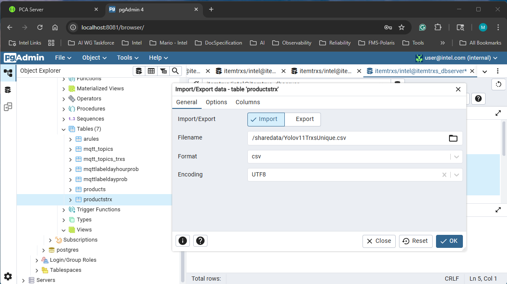
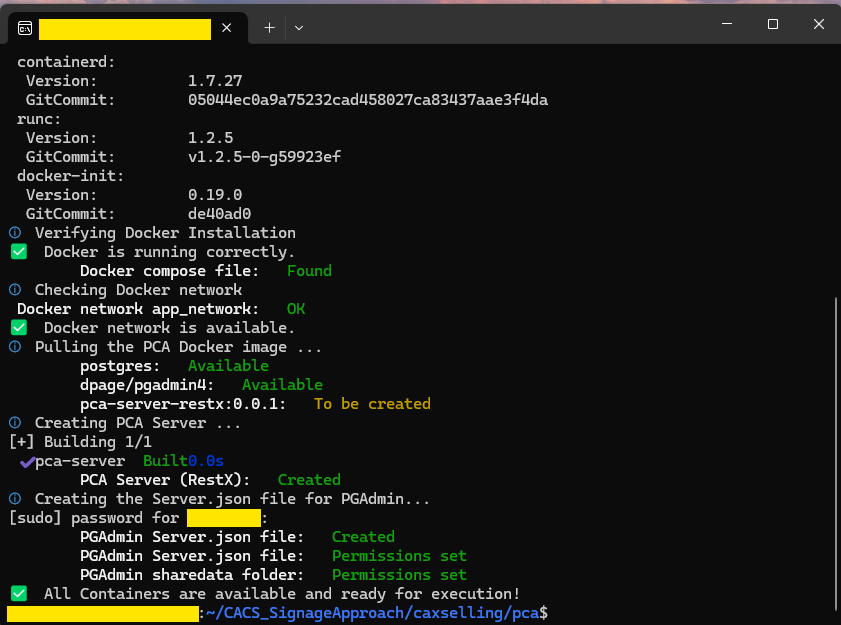
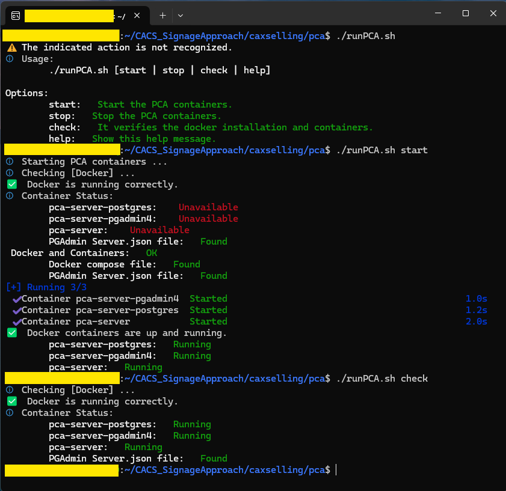
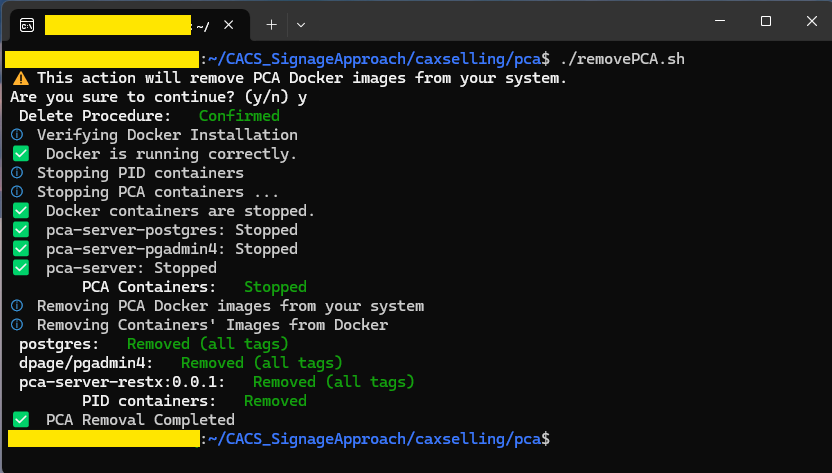
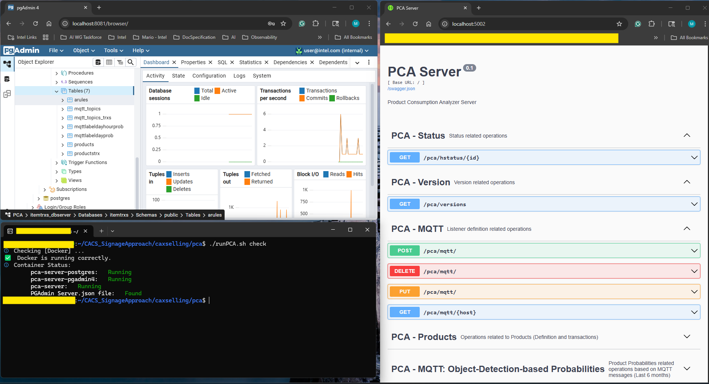

# Product Consumption Analyzer (PCA)

| [Project Readme.md](../../README.md) | [CAXSelling Readme.md](../README.md) |

It describes the functionalities and package organization of the Product Consumption Analyzer (PCA). It analyzes the provided transactions (whether from a database or the detection sequence) to detect joint item occurrences and perform association rules analysis. It queries concurrent items based on the joint detected frequencies for involved items.

Content:

- [Conceptual Approach and Container Initialization](#conceptual-approach-and-container-initialization)
  - [Configuration](#configuration)
  - [Database Tables](#database-tables)
- [Intel Hardware Drivers](#intel-hardware-drivers)
- [Management Scripts](#management-scripts)
- [Testing PCA Server](#testing-pca-server)

## Conceptual Approach and Container Initialization

The [docker compose file](./docker/docker-compose.yml) starts a Postgres Server, PGAdmin Web UI, and the PCA Server.

- pca-server-postgres: It is the container name for the Postgres server. It initializes the PCA server database (Default name: itemtrxs).
- pca-server-pgadmin4: It is the container name for the PGAdmin4 Web UI. You can manage the Postgres Database directly if required.
- pca-server: It is the Prodcut Consumption Analyzer Server.

It provides two approaches:

- **Real-time**: It calculates product probabilities for product IDs (aligning trained model classID and the products table) based on object detections fed from MQTT detections. It allows filtering the top k products detected daily and per day and hour to provide suggestions when no historical data is available.
- **Offline**: It discovers association rules based on historical transactions provided by the customer. It is only required transactionID and productID columns. It provides suggestions based on product associations and complements the estimated probabilities. For example, given a likely product on a given day and hour, it could provide the associated ones to create the ads.

The folder organization is as follows:

```bash
├ docker
│   └─ sharedata # Shared folder between the host and PGAdmin4 for data exchange (Import/Export)
├ src # PCA Server (Source Code)
├ Dockerfile #It defines how to build and start the PCA Server
├ installPCA.sh # The installation Script
├ runPCA.sh # The initialization and check Script
├ removePCA.sh # The removal Script
```

### Configuration

The [sample.env](./docker/sample.env) file is a sample configuration file. If you want to reuse it, update the corresponding values (See Table below) and rename it to .env before starting the containers.

|Group | Variable|Objective|Observation|
|---|---|---|---|
|pca-server-postgres|POSTGRES_USER|Postgres admin User| Default: intel|
|pca-server-postgres|POSTGRES_PASSWORD|Postgres admin User passowrd| Default: intel|
|pca-server-postgres|POSTGRES_PORT|Postgres port| Default: 5432|
|pca-server-pgadmin4|PGADMIN_DEFAULT_EMAIL|PGAdmin4 admin User Email (ID)| Example: <user@intel.com>|
|pca-server-pgadmin4|PGADMIN_DEFAUL_DIR|PGAdmin4 admin user folder in the container| Example: "/var/lib/pgadmin/storage/user_intel.com"|
|pca-server-pgadmin4|PGADMIN_DEFAULT_PASSWORD|PGAdmin4 admin User password| Example: intel|
|pca-server-pgadmin4|PGADMIN_WEBPORT|PGAdmin4 WebUI Port| Default: 8081|
|pca-server|PCA_SERVER_USER|PCA Server admin user| Example: intelmicroserviceuser|
|pca-server|PCA_PORT|PCA Server port| Default: 5002|
|pca-server|UID|PCA Admin user uid| Default: 1999|
|pca-server|PCA_SAMPLEDATA|It initializes products (IDs and Names) based on [Yolov11 data](./docker/sharedata/ProductsYolov11SEG.csv)| Default: YES|
|proxy|http_proxy|environment variable with http proxy information| Default: ${http_proxy}|
|proxy|https_proxy|environment variable with https proxy information| Default: ${https_proxy}|
|proxy|no_proxy|environment variable for the address that the proxy is not required| Example: localhost,eii-nightly-devops.iind.intel.com,127.0.0.1|

[&uarr; Top](#product-consumption-analyzer-pca)

### Database Tables

The PCA Server uses a few tables in the public shema to keep information about the topics under monitoring, detected objects, products under analysis, transactional history (when available), detected rules, product probabilities, among other aspects. The following table synthesizes the database organization.

|Table | Objective|Observation|
|---|---|---|
|[arules](#arules)|It stores the last association rules discovered based on data available in productstrx exclusively|It complements the real-time detections|
|[mqtt_topics](#mqtt_topics)|It stores the topics under monitoring for object detection||
|[mqtt_topics_trxs](#mqtt_topics_trxs)|It stores the detections for each monitored topic||
|[mqttlabeldayhourprob](#mqttlabeldayhourprob)|It stores the product probability per day and hour in a week based on detections exclusively|The sum of all products given a day and hour is 1|
|[mqttlabeldayprob](#mqttlabeldayprob)|It stores the product probability per day in a week based on detections exclusively|The sum of all products given one day is 1|
|[products](#products)|It stores the basic product information aligned with the object detection trained model.||
|[productstrx](#productstrx)|It stores the transactional history for products when available.|You can import the [Yolov11TrxsUnique](./docker/sharedata/Yolov11TrxsUnique.csv) file in this table as a demo|

[&uarr; Top](#product-consumption-analyzer-pca)

#### arules

It stores the last association rules discovered based on data available in productstrx exclusively. The algo is On-demand triggered from the PCA Server API.

|Column|Type|Objective|Null|Observation|
|---|---|---|---|---|
|uuid|integer|Rule identificator|NOT NULL|DEFAULT nextval('arules_uuid_seq'::regclass)|
|antecedentitemsets|bytea|Antecedents of the discovered rules|NOT NULL|It is a Numpy array|
|consequentitemsets|bytea|Consequent itemsets of the discovered rules|NOT NULL|It is a Numpy array|
|confidence|bytea|Condifence of the discovered rules|NOT NULL|It is a Numpy array|
|largeitemsets|bytea|large itemsets of the discovered rules|NOT NULL|It is a Numpy array|
|largeitemsetssupport|bytea|large itemsets support of the discovered rules|NOT NULL|It is a Numpy array|
|min_confidence|double precision|Min confidence defined to run the association rule algorithm|NOT NULL|DEFAULT 0.7|
|min_support|double precision|Min support required defined to run the association rule algorithm|NOT NULL|DEFAULT 0.001|
|ntransactions|integer|Total number of records from productstrx at the time where the algorithm run|NOT NULL|DEFAULT 0|

[&uarr; Top](#product-consumption-analyzer-pca) | [&uarr; Database Tables](#database-tables)

#### mqtt_topics

It stores the topics under monitoring for object detection. The topic management is achieved through the PCA Server API.

|Column|Type|Objective|Null|Observation|
|---|---|---|---|---|
|id|integer|Identifier|NOT NULL|DEFAULT nextval('mqtt_topics_id_seq'::regclass)|
|hostname|character varying(255)|MQTT Broker hostname|NOT NULL||
|port|integer|MQTT Broker port|NOT NULL||
|topic|character varying(255)|Topic to read from the MQTT Broker|NOT NULL||
|message|text|descriptive information|NOT NULL||
|created_at|timestamp without time zone|Instant where it started to monitor the topic|NOT NULL|DEFAULT CURRENT_TIMESTAMP|

[&uarr; Top](#product-consumption-analyzer-pca) | [&uarr; Database Tables](#database-tables)

#### mqtt_topics_trxs

It stores the detections for each monitored topic. It incorporates any detection notification automatically for the registered topics.

|Column|Type|Objective|Null|Observation|
|---|---|---|---|---|
|hostname|character varying(255)| MWTT Broker hostname|NOT NULL||
|port|integer|MQTT Broker port|NOT NULL||
|topic|character varying(255)|Monitored topic|NOT NULL||
|hpt_order|integer|Insertion order|NOT NULL|DEFAULT nextval('trxbyday'::regclass)|
|frameid|integer|Number of frame for the detection|NOT NULL||
|label_class|character varying(255)|Detected class|NOT NULL||
|label_id|character varying(255)|Class ID for the model. It must be aligned with the products table|NOT NULL||
|confidence|double precision|Confidence for the detected class|NOT NULL||
|video_height|integer|Associated video heigh as a reference for the bounding box|NULL||
|video_width| integer|Associated video width as a reference for the bounding box|NULL||
|boundingbox|json|Bounding Box where the class is detected in the frame|NULL||
|created_at|timestamp without time zone|Creation time in DB Server|NOT NULL|DEFAULT CURRENT_TIMESTAMP|
|trx_dd|integer|Day of the month of the detection|NOT NULL|DEFAULT: EXTRACT(day FROM CURRENT_TIMESTAMP)|
|trx_mm|integer|Month of the detection|NOT NULL|DEFAULT: EXTRACT(month FROM CURRENT_TIMESTAMP)|
|trx_yyyy|integer|Year of the detection|NOT NULL|DEFAULT: EXTRACT(isoyear FROM CURRENT_TIMESTAMP)|
|trx_quarter|integer|Quarter of the detection|NOT NULL|DEFAULT: EXTRACT(quarter FROM CURRENT_TIMESTAMP)|
|trx_dayofweek|integer|ISO Day of Week of the detection. Monday(1) & Sunday(7)|NOT NULL|DEFAULT: EXTRACT(isodow FROM CURRENT_TIMESTAMP)|
|trx_dayofyear|integer|Day of the year of the detection|NOT NULL|DEFAULT: EXTRACT(doy FROM CURRENT_TIMESTAMP)|
|trx_hh24|integer|Hour of the detection|NOT NULL|DEFAULT: EXTRACT(hour FROM CURRENT_TIMESTAMP)|
|trx_minute|integer|Minute of the detection|NOT NULL|DEFAULT: EXTRACT(minute FROM CURRENT_TIMESTAMP)|
|trx_timezone|integer|Timezone|NOT NULL|DEFAULT: EXTRACT(timezone FROM CURRENT_TIMESTAMP)|

[&uarr; Top](#product-consumption-analyzer-pca) | [&uarr; Database Tables](#database-tables)

#### mqttlabeldayhourprob

It stores the product probability per day and hour in a week based on detections exclusively|The sum of all products given a day and hour is 1

|Column|Type|Objective|Null|Observation|
|---|---|---|---|---|
|hostname|character varying(255)| MWTT Broker hostname|NOT NULL||
|port|integer|MQTT Broker port|NOT NULL||
|topic|character varying(255)|Monitored topic|NOT NULL||
|label_class|character varying(255)|Detected class|NOT NULL||
|label_id|character varying(255)|Class ID for the model. It must be aligned with the products table|NOT NULL||
|dow|integer|ISO Day of Week of the detection. Monday(1) & Sunday(7)|NOT NULL||
|hh24|integer|Hour of the detection|NOT NULL||
|probability|double precision| Probability of detection for the label_class in the indicated day of week and hour|NOT NULL|Value between 0 and 1|

[&uarr; Top](#product-consumption-analyzer-pca) | [&uarr; Database Tables](#database-tables)

#### mqttlabeldayprob

It stores the product probability per day in a week based on detections exclusively|The sum of all products given one day is 1|

|Column|Type|Objective|Null|Observation|
|---|---|---|---|---|
|hostname|character varying(255)| MWTT Broker hostname|NOT NULL||
|port|integer|MQTT Broker port|NOT NULL||
|topic|character varying(255)|Monitored topic|NOT NULL||
|label_class|character varying(255)|Detected class|NOT NULL||
|label_id|character varying(255)|Class ID for the model. It must be aligned with the products table|NOT NULL||
|dow|integer|ISO Day of Week of the detection. Monday(1) & Sunday(7)|NOT NULL||
|probability|double precision| Probability of detection for the label_class in the indicated day of week|NOT NULL|Value between 0 and 1|

[&uarr; Top](#product-consumption-analyzer-pca) | [&uarr; Database Tables](#database-tables)

#### products

It stores the basic product information aligned with the object detection trained model.

|Column|Type|Objective|Null|Observation|
|---|---|---|---|---|
|idproduct|integer|Product Identifier. It must be aligned with the label_id of the object detection model.|NOT NULL||
|pname|character varying(255)|Product short name. It must be aligned with the label_class of the object detection model.|NOT NULL||
|pdescription|text|Product description. It gets used for image generation when it needs to incorporate the product.|NULL||
|price|double precision|Product price. It gets used for image generation when it needs to incorporate the product.|NULL||

If you are using Yolov11-SEG from Ultralytics in the [Product Identification Microservice](../pid/README.md), you could incorporate initial product details enabling SAMPLE_DATA in the configuration (See the [configuration](#configuration) section). The model is trained using [COCO dataset](https://github.com/ultralytics/ultralytics/blob/main/ultralytics/cfg/datasets/coco.yaml).

[&uarr; Top](#product-consumption-analyzer-pca) | [&uarr; Database Tables](#database-tables)

#### productstrx

It stores the transactional history for products when available.

|Column|Type|Objective|Null|Observation|
|---|---|---|---|---|
|idtransaction|integer|Transaction Identifier. |NOT NULL||
|idproduct|integer|Product Identifier. It must be aligned with the label_id of the object detection model.|NOT NULL||
|quantity|integer|Quantity of the product in the transaction|NOT NULL|Default: 1|
|unitaryprice|double precision|Unitary price of the product in the transaction|NULL||

You can import the [Yolov11TrxsUnique](./docker/sharedata/Yolov11TrxsUnique.csv) file in this table as a demo. The host and container share the sharedata folder so that you can import the file (or any other file) through PGadmin4-Web from /sharedata/Yolov11TrxsUnique.csv.



[&uarr; Top](#product-consumption-analyzer-pca) | [&uarr; Database Tables](#database-tables)

## Intel Hardware Drivers

It is critical to set up and install proper drivers to ensure the full benefits of the hardware on top of which the containers run. Scripts will take care of it for you. Details on it are available [here](../pid/README.md#intel-hardware-drivers) for your reference.

[&uarr; Top](#product-consumption-analyzer-pca)

## Management Scripts

It proposes three scripts focused on the PCA installation, delete, and running management (See Table 1).

**Table 1:** Management Scripts

|Script|Objective|Observation|
|---|---|---|
|[installPCA](./installPCA.sh)|It verifies OS compatibility and installs dGPU/iGPU and NPU drivers.|Preferred: Ubuntu 22.04/24.04|
|[removePCA](./removePCA.sh)|It stops containers and removes associated images.|It keeps dependencies|
|[runPCA](./runPCA.sh)|It starts, stops, and checks the PCA Server.|Version 0.1.0|

### Installing PCA

1. Go to the "~/.../caxselling/pca" folder
1. Run the installation script. It requires administrative permissions.

```bash
./installPCA.sh
```

Expected outcome:



The [server.json](./docker/servers.json) file is automatically created based on the Docker configuration and provided to register the server exclusively during the first run of the PGAdmin4 container.

[&uarr; Top](#product-consumption-analyzer-pca) | [&uarr; Management Scripts](#management-scripts)

### Running PCA

The [runPCA.sh](./runPCA.sh) script allows it to start, check, and stop PCA server and the associated containers.

1. Go to the "~/.../caxselling/pca" folder
1. Run the runPCA script with the pertinent option (See the figure).



[&uarr; Top](#product-consumption-analyzer-pca) | [&uarr; Management Scripts](#management-scripts)

### Removing PCA

This script stops the containers (when running) and removes the associated images from Docker.

1. Go to the "~/.../caxselling/pca" folder
1. Run the removePCA script

```bash
./removePCA.sh
```

Expected outcome:



[&uarr; Top](#product-consumption-analyzer-pca) | [&uarr; Management Scripts](#management-scripts)

## Testing PCA Server

Once started the PCA Server, you could access PGAdmin4 Web UI to manage the database itemtrxs (tables are automatically created) and test every API documented through SwaggerUI as shown below.



[&uarr; Top](#product-consumption-analyzer-pca) | [&uarr; Management Scripts](#management-scripts)
